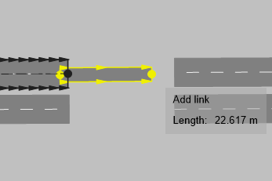
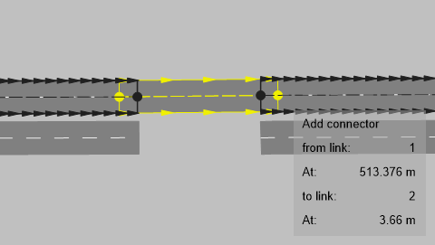
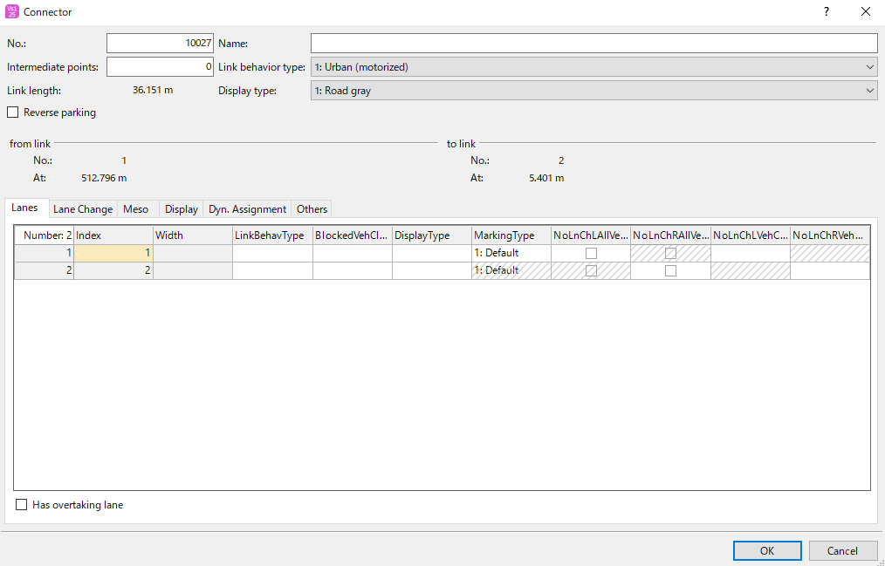
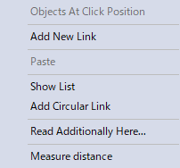
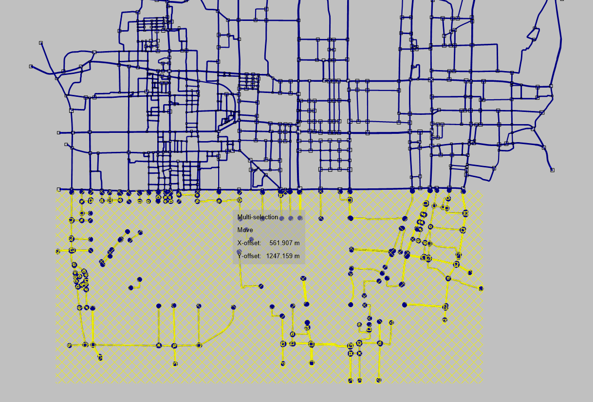

# OSM to Vissim map

OSMデータからVissimのマップに変換する際に使用するスクリプト
以下の論文に記載しているスクリプト（詳細は論文を参照のこと）
[1] 鈴木潮音, 岡﨑翔大, 八木陵介, 西前太揮, 重野寛, 吉廣卓哉, 都市規模交通シミュレーションのための交通・信号制御モデルの作成支援スクリプト, 情報処理学会論文誌, 2025（採録決定）. 
 
# 概要
OSMデータからVissimのマップに手作業＋スクリプトによる自動化によって変換する

# 開発・実行環境

## 開発時のVissimのバージョン
PTV Vissim 2022 (SP 13)

## プログラム言語のバージョン
Python 3.8.8+

## 必要ライブラリ
- numpy

## 必須環境
- Windows
- pythonスクリプトからVissimのAPIを使用できる環境

# 手順
OSMデータからVISSIMで使用できるマップに変換する手順を以下に記載する

## 1.OSMデータの取得とOpenDrive形式に変換してVISSIMで読み込む
**手作業**
マップとして使用したいエリアのOSMデータを取得する
マップの範囲が広い場合、OSMの一度に取得できるオブジェクト数に制限があるため1回で取得できない場合があります
その場合は、分割して以下作業を行っていき 3. の最後の (2h) にて結合するようにします

OSM2XODRを使用してOSMからOpenDrive形式に変換し、VISSIMのimport機能を使用して読み込む

## 2.道路モデルの修正 
**手作業**
読み込んだ道路モデルに不具合があるので**手作業**とスクリプトを利用して修正する
以下の順番に沿って修正を行います

### (2a)細街路の削除
**手作業**
シミュレーションで使用しないと考えらえる道路の削除を行ってください

### (2b)交差点領域のノードとコネクタの全削除
**手作業**
交差点内の道路のつながりがおかしい部分があるので、全ての交差点内の道路を全削除します
後でスクリプトにより生成します

### (2c)リンクの進行方向、車線数、リンク長などの修正
**手作業**
Googleマップなどを参考に不適切な部分を修正してください

### (2d) ノードの作成スクリプトの実行
交差点領域にノードを設置します
(2c)までの作業を行った後、ipnxファイルとして保存します
ipnxファイルを`set_nodes.py`と同じディレクトリに設置します
`set_nodes.py`内の上部に設定項目がありますので確認と編集をしてください
`python set_nodes.py`で実行してください

### (2e) ノードの調整
**手作業**
(2d)のスクリプト実行後に生成されるipnxファイルを編集していきます
複雑な交差点や交差点が隣接しているとノードが正しく設置できていない場合があるため、確認して修正します

マップの端のリンク端にもノードが設置されますが、それはそのままにしておいてください

### (2g) 直線道路補正スクリプトの実行
**手作業**＋スクリプト
細街路の削除により、交差点領域を結ぶ道路が複数のリンクに分断されてしまうのでその修正を行います
手作業にて以下を行います
- 細街路を削除したことになるによって交差点ではなくなる場所もノードが設置されていますのでノードの削除
- ノード削除後、つながるべきリンクをコネクタによって接続します
#### リンクをコネクタでつなげる方法
1. 上流のリンクにカーソルを合わせ、Ctrlキーを押しながら右クリックします
2. Ctrlキーと右クリックを押したまま、カーソルを下流のリンクに移動させます

3. カーソルが下流のリンクにある状態で、Ctrlキーと右クリックを離します

4. 詳細設定画面が表示されますが、設定の変更は不要です
そのまま「OK」を押してコネクタの設置を完了します

コネクタの向きを誤ると、道路として認識されないので注意してください

以上の作業を行った後、ipnxファイルとして保存します
ipnxファイルを`merge_link.py`と同じディレクトリに設置します
`merge_link.py`内の上部に設定項目がありますので確認と編集をおこなってください
`python merge_link.py`で実行してください

このスクリプトによってつなげたリンクとコネクタが１つのリンクとして置換されます

### (2h) 地図データを統合
**手作業**
OSMのデータ取得時にオブジェクト数の制限により、分割して取得して作業を行っている場合、ここで結合をしていきます
#### 地図データ追加読み込みの方法
1. マップの追加読み込みをしたい場所にカーソルを合わせ、右クリックします
2. メニューからRead Additionally Here...を選択します

3. 読み込みたいマップのファイルを選択します
4. 詳細設定画面が表示されますが、設定の変更は不要です
「OK」を押してください
5. 読み込んだ道路も道路モデルの位置関係を調整し、接続部分の道路モデルを手作業にて修正します

## 3.交差点内のリンク接続と信号パターンの設置 
交差点内のコネクタの設置と信号の設置、ならびに信号パターン作成をおこなう

### (3a) 信号作成スクリプトの実行
交差点領域である各ノード内にあるリンク端をコネクタによって接続行いながら、信号を設置していく
(2h)までの作業を行った後、ipnxファイルとして保存します
ipnxファイルを`set_connect.py`と同じディレクトリに設置します
`set_connect.py`内の上部に設定項目がありますので確認と編集をおこなってください
`python set_connect.py`で実行してください

### (3b) 手作業で交差点のコネクタと信号の修正を行う
**手作業**
コネクタと信号が設置されるのはT字路および十字路のみになります
その他の場所については**手作業**で設置をおこなってください
また、おかしな部分がありましたら修正してください

### (3c) 2状態交差点のためのシグナルグループを作成する
**手作業**
1. タブからSignal Control > Signal Controllersを選択します
2. 緑色の「Add」アイコンをクリックします

3. Edit controller dataをクリックします

4. Signal groupsを開き、緑色の「Add」アイコンをクリックして、シグナルグループを4つ作成します

5. Signal groupsを開き、「Add」アイコンをクリックして、シグナルプログラムを1つ作成します
6. Editをクリックし、作成したシグナルプログラムを編集します

Signal sequenceを全てRed-Green-Amberに変更してください
Signal groupの1、3は直進または左折用に、2、4は右折用に設定してください
信号サイクルを変更したい場合はCycle timeから変更可能です
以下は設定例です

7. 左上の黄色い「Save data and go back to Vissim」アイコンをクリックし設定を保存してください

8. 最後に、OKをクリックして操作は完了です
OKを押さずに編集画面を閉じてしまうと、設定が保存されないので注意してください

### (3d) 信号パターン作成スクリプトの実行
**手作業**＋スクリプト
T字路および十字路に対して信号パターンを各信号に割り当てる
#### ベースの信号グループの設定方法
信号制御の基準となるノードの信号グループを設定します
1. Network ObjectsからSignal Headsのリストを開いてください

2. 地図で設定したい信号をカーソルをドラッグして選択してください

選択された信号が、リストでハイライトされます

3. SignalSwitchに"True"もしくは"False"を設定します
対向する道路の信号、つまり同じパターンで制御される信号でSignalSwitchの設定をそろえるようにしてください

4. ベースとなる信号全てにこの設定を行います
隣接する交差点でSignalSwitchの設定を整合するようにしてください
以下の画像の場合、横方向および縦方向の道路に設置された信号について、SignalSwitchの値を統一します

#### 基準となる信号グループが決まっているノードの設定方法
`set_signal.py`内のBASE_NODE_NUMBERSが基準となるノードのリストです
ここに、基準となるノードの番号を入力してください
ノード番号はカーソルをノードに合わせることで確認出来ます

(3c)までの作業を行った後、ipnxファイルとして保存します
ipnxファイルを`set_signal.py`と同じディレクトリに設置します
`set_signal.py`内の上部に設定項目がありますので確認と編集をおこなってください
`python set_signal.py`で実行してください

ConflictAreaの設定も`set_signal.py`で行っています

スクリプト実行後
T字路および十字路以外の箇所は**手作業**で設定をおこなってください
また、おかしな部分がありましたら修正してください

## それぞれのスクリプトについて論文中のどの工程で使用するか
### set_nodes.py
(2d) ノードの作成スクリプトの実行
### merge_link.py
(2g) 直線道路補正スクリプトの実行
### set_connect.py
(3a) 信号作成スクリプトの実行
### set_signal.py
(3d) 信号パターン作成スクリプトの実行

# 作成者
* Shion Suzuki, Taiki Nishimae, Takuya Yoshihiro
* 所属 Graduate School of Systems Engineering, Wakayama University
* tac@wakayama-u.ac.jp
 
# ライセンス
"OSM to Vissim map" is under [MIT license](https://en.wikipedia.org/wiki/MIT_License).